### Prise en main de Node :
il faut maintenant que j'installe Node. On m'a expliqué que c'etait un un outil très utilisé par les développeurs pour pouvoir mieux coder l'interface des sites.

Malheureusement, l'installation ne s'est pas fait de manière parfaite.

J'ai donc unn problème dans le terminal de Windows Powershell. Il n'arrive pas à éxecuter le fichier npm, alors qu'il devrait pouvoir le faire.

Je continue de chercher une solution.

C'était dû au fait que j'avais changé le dossier nodejs de place, en essayant de réparer une plus petite erreur.

J'ai maintenant une autre erreur, où on me dit que le fichier npm n'est pas signé digitalement.

J'essaye de faire un pull request pour voir si ça change quelque chose.

J'ai finalement réussi à faire marcher depuis le command prompt, et j'ai appris quelques règles de manipulations importantes ; Il faut absolument que les images présentées dans les fichiers soit accessibles, et que le site ne s'ouvrira pas si il y a un problème de compilation.

C'est très pratique node, on peut voir les changements en temps réel comme si c'était un vrai site.

À faire demain : Installer nodejs sur le pc, et faire comme sur ce pc pour le repo du site.

Je n'ai finalement pas fait les installations sur mon PC fixe, car je ne vois pas vraiment l'intérêt.

Pour rappel, voici le chemin exact pour ouvrir node, dans le command prompt : 

```cd C:\Users\milan\OneDrive\Documents\A2.2\hybridizer-io.github.io```

Puis 

```npm run start```

## Suite de tests d'exemples : 

On va aujourd'hui continuer les tests des exemples hybridizer :

#### Test **Printf** : 
La sortie nous donne une série de "hello", avec chacun d'entre eux venant d'un thread et d'un bloc différent.

On a donc une sortie comme ça : 

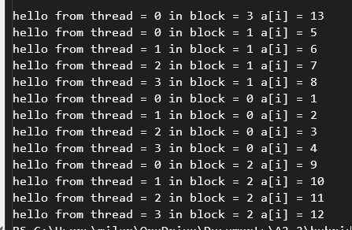 

#### Test **Recursion** : 
Ce code est censé calculer 33 millions de factorielles sur le GPU
et retourner "OK" si les calculsse sont bien faits. La vérfication est faite par le CPU, une fois
que le GPU a tout calculé.

On lit bien "OK" dans notre terminal.

#### Test **Reduction** : 
Ce code est censé calculer la somme d'un très grand tableau (33 millions de cases)
en utilisant une approchge Grid-Stripe loop. 

Le résultat est donc : 

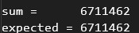 

Définition Grid-Stride loop : Il s'agit d'une boucle où chaque thread GPU traite 
plusieurs éléments du tableau en faisant des bonds en avant. En effet, quand il n'y a pas assez de threads pour faire 
tous les calculs, le code attribue le calcul nunméro X+1 au premier thread. X corresponds au nombres de threads solicités.


### Passage au exemples Imaging :

#### Test **Sobel** : 
Ce code est censé détecter les contours d'une image, en la mettant en noir et blanc, 
 en observant les variations de couleurs. Il enregistre ensuite l'image suivante :

Résultat : On ne peut savoir, car on a pas de résultats dans le powershell.

Une IA nous dit qu'il faut avoir une image de base, ce qui paraît cohérent.
On essaye en enregistrant une image au bon endroit. 

Malgré le fait que j'enregistre une image PNG au bon endroit, je ne trouve pas une image générée dans le net8.0.

Il faut donc réparer ce code, ou expliciter comment mieux l'utiliser.

/!\ À réparer dans la documentation /!\

#### Test **Sobel_2D** : 
Ce code est différent du premier, car il utilise une structure rigide, 
où l'image doit obligatoirement être en 512x512. Le code est donc plus simple, car il n'a pas besoin 
de calculer/utiliser la largeur et la longueur de l'image.

De plus, ce code serait censé ouvrir l'image, sauf que rien ne s'ouvre dans mon cas, 
et le code ne semble pas compiler.

Je dois donc demander à mon tuteur comment faire marcher ces codes.

/!\ À réparer dans la documentation /!\

### Passage au exemples Maths :

#### Test **ConjugateGradient** : 
Ce code utilise l'algorithme du Gradient Conjugué, 
Il résout le système linéaire Ax = B, où A est une matrice creuse.

En terme de sortie, nous avons une suite de chiffres décroissantes qui s'écrivent à la suite. J'en conclut donc qu'il y a un problème, car ce décompte ne s'arrête jamais.

Dans le code, il est précisé que la convergence est très lente, donc c'est peut être normal après tout.

Je dois donc demander à mon tuteur si c'est quelque chose de normal.

#### Test **Mandelbulb** : 
Ce code est censé calculer la puissance de la carte graphique.

Lors du calcul, la compilation nous précise qu'il faut que le GPU soit CUDA-Compatible, et donne des informations 
sur comment y accéder. Comme c'est la première fois que je compile, 
je n'ai pas pu suivre les instructions.

Je fais donc ce que me dit la sotie, et je réessaye.

Cette fois-ci, la compilation ne fonctionne toujours pas.

Une fois qu'on a fait la manipulation demandée, on se retrouve avec ces informations dans le terminal :

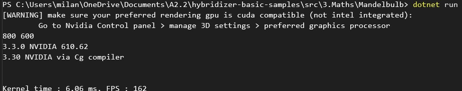 

De plus, une autre fenêtre s'ouvre et montre une sorte de graine qui est difficile à décrire :

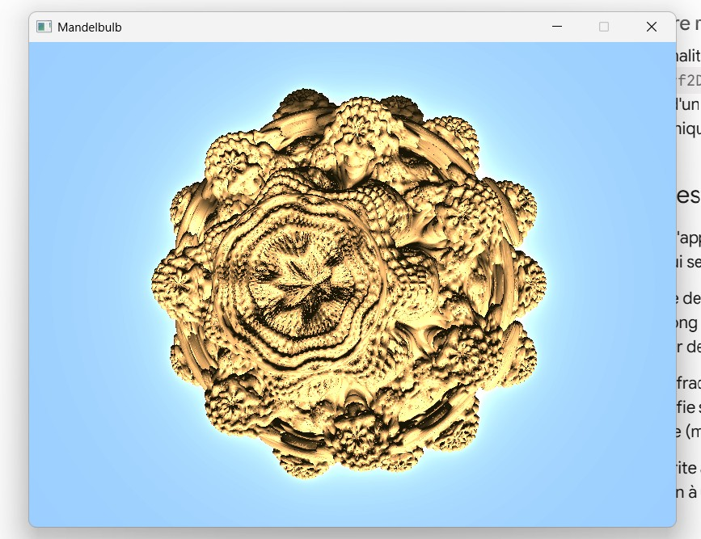 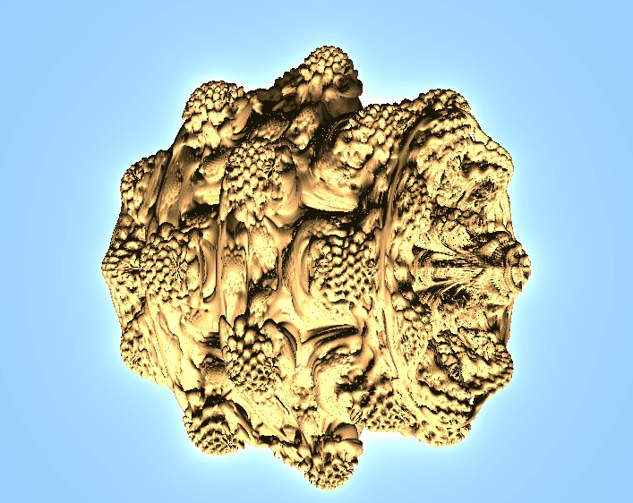 

#### Test **MonteCarloHeatEquation** : 
Cette fois-ci, le code semble beaucoup plus compliqué, 
car le dossier comprends plusieurs dossiers différents, avec beaucoup de classes en tout.

J'essaye donc de mettre tous les fichier .cs dans une conversation avec un agent IA, pour essayer de comprendre ce que font 
toutes ces classes.

L'IA me confirme qu'il s'agit d'un solveur de l'équation de la chaleur en 2D.

Dans le dossier de MonteCarloHeatEquation, on nous donne aussi une image d'exemple de résultat, 
qui est cette photo : 

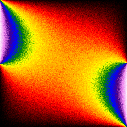 

#### Test **NBody** : 
Ce code est censé calculer les interactions gravitationnelles
entre des milliers de particules dans l'espace. Il utilise notamment OpenGL, 
ce qui lui premet d'enregristrer ces tampons dans CUDA.

Résultat perçu : la commande powershell compile à l'infini, et la fenêtre qui s'ouvre n'affiche rien.

Je referme l'onglet powershell, et je réessaye de faire run le code.

On retombe sur le même probleme, il faudra donc essayer de résoudre ces problèmes.

/!\ À réparer dans la documentation /!\ 

Définition OPENGL : Il s'agit d'une "boîte à outils hitorique et universelle qui permet aux dévelloppeurs 
de donner des ordres à la carte graphique pour dessiner des images en 2D ou en 3D sur l'écran.

Mon PC commence à beaucoup chauffer, donc je vais passer à la modification du site depuis NODE.

J'ai continué à faire quelques petits changements, notamment des petites corrections, et j'ai ajouté des problèmes de troubleshooting dans le tableau. 

Ces problèmes viennent de mes propres expériences avec l'installation de Hybridizer.

J'essaye d'abord de connecter visual studio code. 

Je continuerais Mardi d'apprendre de nouvelles techniques et raccourcis Markdown pour améliorer la présentation du site.

J'ai réussi à intégrer des images dans le code du site, mais il faut que je demande à mon tuteur de stage s'il me permet de les raouter 
dans le dossier de la doc.

On va continuer les exemples des tests : 

Rappel pour accéder au tests depuis le terminal. Par exemple, pour le test nbody : 


```cd C:\Users\milan\OneDrive\Documents\A2.2\hybridizer-basic-samples\src\3.Maths\NBody```

Puis 

```dotnet build```

Puis 

```dotnet run```

#### Test **Newton** : 
Ce code est censé générer une fractale de Newton, en résolvant 
l'équation x^3 = 1. Il doit ensuite comparer le temps moyen pour la génération de chaque image 
entre le CPU et le GPU. 

La sortie que l'on a est 

``` C# time per image : 5263 ms```

```CUDA time per image : 63 ms```

On en déduit donc que la compilation s'est bien faite, et donc que le code fonctionne !

#### Test **SharedMatrix** : 
Ce code est censé prendre 4 dimensions en argument, (ici on a 512x512x512x512)
 et ensuite créer 2 matrices des ces dimensions en les remplissant de variables aléatoires.

Le code, contrairement au précédent, n'utilise pas de stopwtach pour calculer la différence de temps 
prise par le CPU et le calcul par GPU, qui est fait 10 fois. 

On a donc pas de sortie avec une comparaison, seulement un message "Done" à la fin. 

/!\ rajouter un stopwatch dans le code pour pouvoir observer la différence /!\

#### Test **SparseMatrixReader** : 
Ce dode est censé calculer A x X, où A est une matrice creuse, et X un vecteur, en utilisant 
le GPU. Il crée une matrice Laplacienne 1D, qui est une matrice avec 10 millions de lignes, présentant
surtout des 0, sauf à peu près 3 valeurs par ligne.

On reçoit en sortie : 

```matrix read -- starting computations```

Ceci est dû au fait que l'on a pas d'autres sortie de prévue après les calculs.

/!\ rajouter une sortie après la sortie actuelle /!\

### Passage au exemples Finance :

Comme précisé pendant une discussion avec mon tuteur de stage, un des buts 
de Hybridizer est de servir à, par exemple, des traders. Avec la version payante, on a accès 
au calculs précis, faits en interne par Hybridizer, qui permettent d'expliquer les choix du trader 
à la personne au dessus de lui dans l'entreprise.

Cela a donc du sens de faire quelques exemples en lien avec la finance.

#### Test **BlackScholes** :
Il s'agit d'un test de validation numérique entre le CPU et le GPU. C'est à dire qu'il faut vérifier si le calcul du GPU est le même que
le calcul du CPU. 

Résultat : La sortie nous indique que le code n'a pas fonctionné. On a cette sortie :

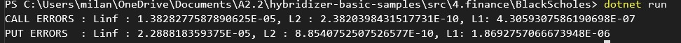 

Il ne s'agit enfait pas d'une erreur, c'est bel et bien la sortie attendue du programme.
Il sert à montrer le très petit écart entre le calcul du CPU et du GPU

Voici ce que chaque partie veut signifie :
- Linf = erreur la plus grande
- L1 : Moyenne Quadratique d'erreurs
- L2 : Moyenne d'erreurs

Dans le language des traders, Call (comme au poker) signifie l'option d'acheter ses actions.

Quant à lui, Put correspond à l'option de vendre ses actions.

#### Test **BlackScholesFloat4** :

Ce code ressemble beaucoup au précédent, mais vectorise les données par pacquet de 4 floats au lieu d'un.

Cela veut dire que le code est plus rapide, car la calcul est moins lourd, mais qu'il y'a moins de précision.

On vérifie cela dans le powershell :

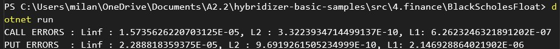 

On remarque en effet, que oui, les erreurs sont plus grandes.

/!\ rajouter un stopwatch dans ce code, et le précédent, pour pouvoir observer la différence /!\

#### Test **StrategyBackTest** :

Ce code est le plus avancé des codes dans la partie Finance, car il prend en compte beaucoup plus de 
paramètres. Il s'agit d'un exemple très concret du GPU computing en finance.

D'ailleurs, il propose une sortie beaucoup plus engagente que les autres programmes.

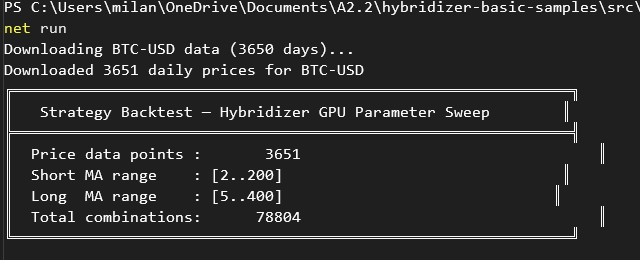 

Vu que mon PC est plutôt lent, j'ai du attendre assez longtemps avant d'avoir le reste de la sortie, mais c'était une bonne nouvelle.

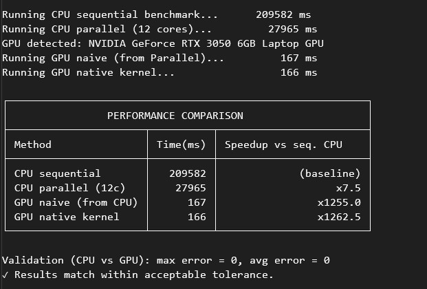 
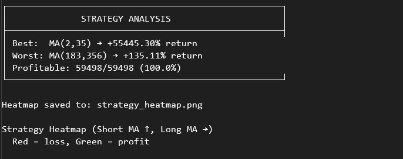 
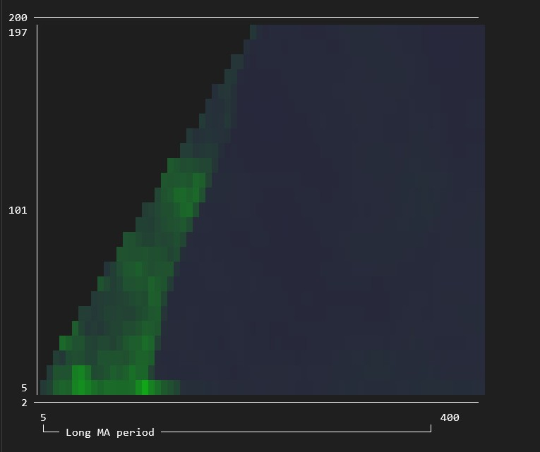 

Ce résultat à l'air très intéressant, mais trop compliqué à comprendre à l'instant.

On remarque néanmoins une irrégularité dans le premier tableau proposé, il faudra donc réparer ceci 
à un autre moment du stage

/!\ Code le plus complet, potentiellement intéressant de le présenter dans l'exemple du site à la place du programme qui ne fonctionne pas /!\ 
/!\ réparer l'interface de la sortie de ce code /!\ 

### Passage aux exemples CUDA Runtime :

#### Test **ConstantMemory** :

Ce code a comme but de montrer la capacité de mémoire constante de la carte graphique. Je n'ai pas compris 
ce que ce code fait précisément, mais il s'agit d'un Stencil. J'ai compris qu'il prends un nombre et le mélange à ses deux voisins de gauche et à ses deux voisins de droite.

Le résultat dit juste DONE, sans autres explications.
/!\ ajouter des informations à la sortie de ce code /!\ 

#### Test **Streams** :

Ce code est censé montrer comment il est possible de faire plusieurs choses en même temps
en parallèle sur le GPU.

Il possède deux tableau de 33 millions de floats, avec le premier rempli de {0,1,2..}
et le deuxième rempli uniquement de 1. Le but est d'ensuite faire 100 fois a[i] += b[i].

On devrait donc avoir un tableau a rempli de nombres croissants à partir de 100.

On retrouve bien cette première ligne en sortie dans le terminal, qui affiche 100, 101, 102, 103 etc...

### Passage aux exemples Advanced :

#### Test **Generic Functions** :

Le but de cet algorithme est d'additionner 1.0f à chaque élément d'un tableau de 32 millions
de floats en passant par le GPU. Il vérifie ensuite que tous les éléments du tableau
valent bien 1.0f. 

Une fois véifié, il écrit OK dans la console, et c'est bien ce que l'on peut observer.

/!\ ajouter des informations à la sortie de ce code /!\ 

#### Test **Generic Memory Access** :

Ce programme montre comment il est possnible d'accéder à la mémoire de façon générique

On remarque néanmoins que dans la sortie, on reçoit un tableau de 4x8, avec quelques 1 éparpillés.

Je ne comprends pas trop à quoi sert ce tableau, je regarde la docs, mais ce programme ne fait pas partie 
des exemples donnés.


#### Test **Generic Reduction** :

Ce code implémente une réduction générique sur GPU.

Définition Réduction Générique : il s'agit du fait de combiner tous les éléments d'un tableau
en une valeur, de façon à ce que le code marche pour tout type d'opération.

En sortie, nous avons que droit à un "OK", donc on se retrouve avec à peu près le même problème que d'habitude.

/!\ ajouter des informations à la sortie de ce code /!\ 

#### Test **Interfaces Reduction** :

Ce code ressemble beaucoup au précédent, mais on utilise à la place une interface polymorphe
classique. 

Définition Interface Polymorphe : Il s'agit d'une interface qui permet de pouvoir appeler
la même méthodes sur des objets différents, et d'avoir des comportements différents selon l'objet.

En sortie, nous avons que droit à un "OK", donc on se retrouve avec à peu près le même problème que d'habitude.

/!\ ajouter des informations à la sortie de ce code /!\ 

#### Test **Lambda Reduction** :

Il s'agit de la troisième variante de réduction, cette fois ci faite avec des lambdas passés 
directement en paramètre. 

Encore une fois, nous avons que "OK" en sortie sur ce programme.

/!\ ajouter des informations à la sortie de ce code /!\ 

#### Test **Simple Meta Data Decorator** :

Ce code est censé tester le fait que Hybridizer est capable de supporter une structure de données
personalisées, combinée à une interface polymorphe.

Ce cas est plus centré objectif, plutôt qu'être un exemple mathématique.

En revanche, la sortie nous fait comprendre qu'il y'a eu un problème dans la compilation du code.

En voici le résultat : 

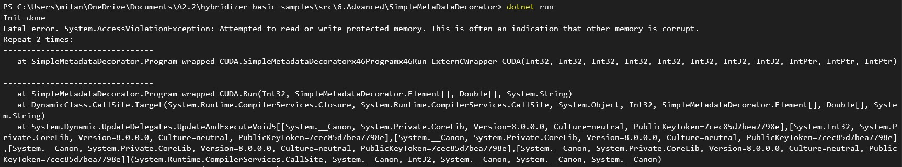 

/!\ réparer ce code/les paramètres de mon pc /!\ 

#### Test **WmmaGemm** :

Ce code est beaucoup plus complexe que les précédents, mais 
grâce à une IA, je comprends qu'il s'agit d'une méthode de multiplication de matrice.

Cependant, le build n'a pas réussi à se faire et tournait en boucle.

/!\ réparer ce code/les paramètres de mon pc /!\

### Passage à l'exemple AI/Tiny Llama  :

Ce code est bien trop long pour que je le comprenne, donc je vais juste lancer le build, puis le run 
pour voir ce qu'il en suit. 

Il faut d'ailleurs, dans ce cas, préciser quel csproj on veut build, car le dossier est très lourd.

On reçoit une partie de la sortie, mais on bloque au moment de trouver le modèle.

/!\ réparer ce code/les paramètres de mon pc /!\

Voici la sortie :

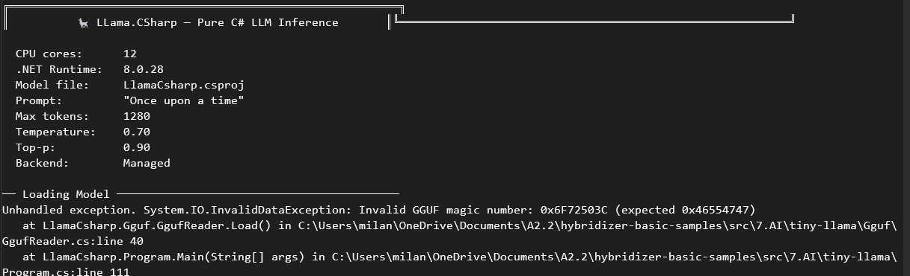 

On fait maintenant le bilan de ce qu'il y a à modifier dans tous ces exemples :

### Modifications à faire la semaine prochaine :

Rajouter un stopwatch pour observer la différence de temps :
- Pour SharedMatrix
- Pour BlackScholesFloat4

Rajouter plus de contenu dans la sortie :
- Pour SparseMatrixReader 
- Constant Memory
- Generic Functions
- Generic Reduction
- Interfaces Reduction
- Lambda Reduction

Réparer le code, ou revoir les paramètres de mon PC :
- Sobel ( trouver l'image, disponible dans SharedResources)
- Sobel2D
- NBody (compilateur infini)
- Simple Meta Data Decorator
- WmmaGemm
- Tiny Llama

Pour StrategyBacktest : Songer à remplacer le code donné dans la doc par celui-ci.
On peut également améliorer un peu l'interface de la sortie, car il y a avait une irrégularité dans le tableau affiché.

Je vais maintenant continuer avec l'édition des fichiers de la Doc.

