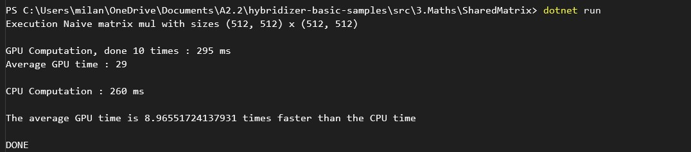
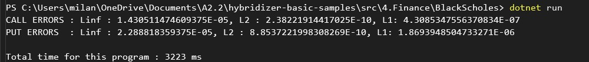
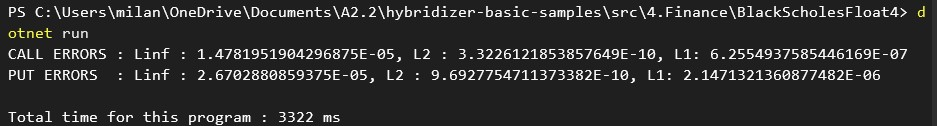
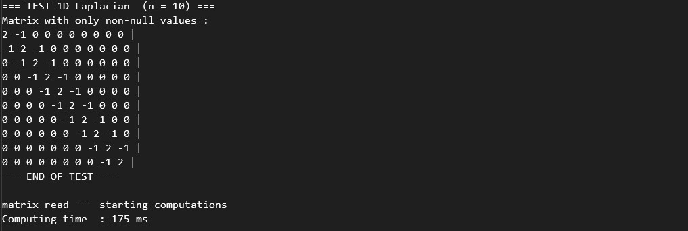
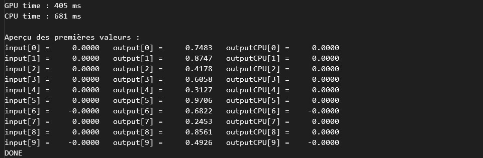
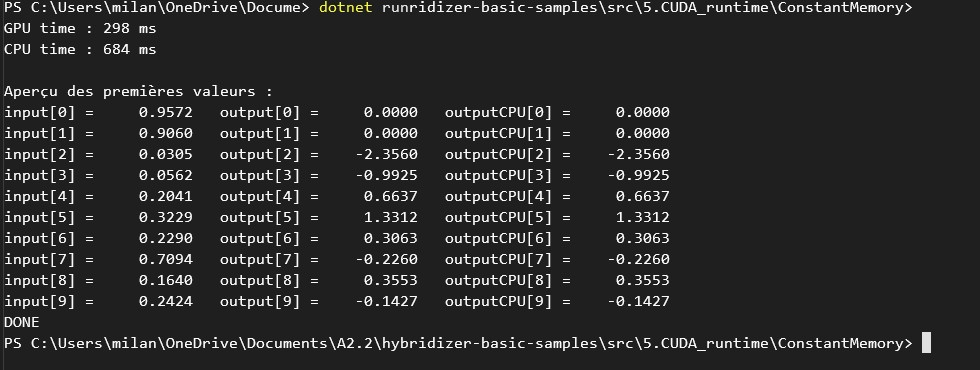
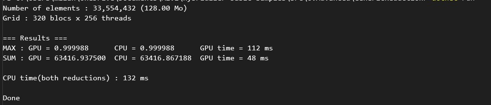
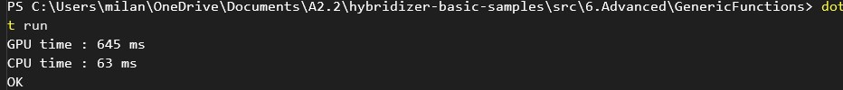
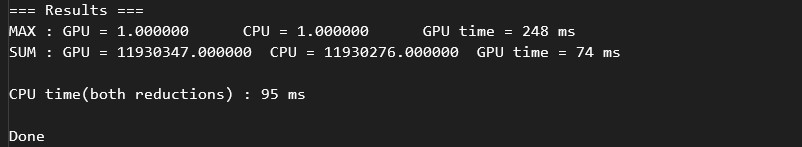
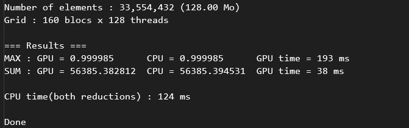

# Semaine 5 :

### Réparation des problèmes des exemples :

##### Amelioration SharedMatrix :
Commençons par le fait de rajouter un stopwatch sur le programme suivant : SharedMatrix.

Pour rappel, ce code doit calculer la différence de temps prise par le calcul par le CPU et le GPU des deux matrices qu'il génère, de taille 512x512.

On essaye donc de relancer le code, et on fera des modifications ensuite.

J'ai donc modifié le code en rajoutant de la mise en forme, et en ajoutant des StopWatch
pour mesurer le temps d'execution du calcul sur le CPU et sur le GPU.   

J'ai également pu calculer la proportion de calcul entre les deux calculs, et écrire le résultat.

Voici l'aperçu de la sortie modifiée :

 

On essaye de faire un commit, mais il n'y a pas de repo sur lequel ont peut l'envoyer, donc on sauvegarde seulement le code modifié.

##### Amelioration BlackScholes :

De la même manière, il faut modifier les codes de BlackScholes et de BlackScholesFloat4, afin de rajouter un stopwatch.

Pour rappel, ce code montre les différences de calcul entre le CPU et le GPU.

Float4 est censé être plus rapide que la version de base, mais ni l'un ni l'autre n'a un détail
sur le temps d'execution, ce qui est dommage.

En réutilisant les mêmes méthodes que pour SharedMatrix, on peut donc rajouter un stopwatch sur les deux codes.

On fait le test dans le Powershell.

 

On fait exactement la même chose pour BlackScholesFloat4, et on obtient :

 

##### Amelioration SparseMatrix :

On passe maintenant aux codes qui auraient besoin d'un peu plus de contenu dans la sortie

Pour rappel, cette fonction créee une matrice Laplacienne 1D.

Nous allons faire en sorte que le code affiche une plus petite matrice de test, 
et qu'on affiche le temps de calcul de la grande matrice.

On passe un peu de temps à modifier le code, en rajoutant ces méthodes :
 - TestLaplacianSmall
 - PrintSparsematrix
 - GetValue

Voici la sortie améliorée :



##### Amelioration ConstantMemory :

Pour rappel, ce code utilise du Stencil, mais je ne comprends pas forcément ce qu'il fait.
J'ai donc demandé à une IA de me donner un code pour me montrer une sortie où je 
pouvais voir les premiers éléments du calcul.

J'ai aussi décider de montrer la différence de temps d'execution entre le CPU et le GPU.

Je rajoute donc la méthode RunCPU, ainsi qu'un stopwwatch sur les deux méthodes.

La sortie ressemble donc finalement à ça :



On remarque toutefois un problème dans la sortie, car les valeurs calculées par le CPU sont différentes de celles du CPU.

Le problème serait dû au problème d'inversion des paramètres, et aussi l'erreur dans la formule du stencil, 
qui donnait à chaque fois des 0. Voici la sortie avec le code corrigé :



##### Amelioration Generic Reduction :

Pour rappel, ce code combine toutes les valeurs d'un tableau en une valeur.

On pourrait donc essayer de montrer cette valeur, ou encore une fois de comparer la différence de calcul 
entre le CPU et le GPU.

Voici la sortie modifiée :



J'ai également solutionné un problème que Claude a relevé :

Atomics.Max a un bug — il fait currentValue + val au lieu de Math.Max(currentValue, val) 
(copié-collé depuis Atomics.Add). Comme la réduction par blocs (reductor.func dans GridReductor) fait déjà le vrai Math.Max en interne, 
l'erreur ne se voit que sur la toute dernière étape (l'agrégation atomique entre blocs), donc ça peut fausser légèrement buffMax[0] selon 
le nombre de blocs qui écrivent en même temps.

##### Amelioration Generic Function :

Pour rappel, ce code teste que `Add` fonctionne bien avec une lambda passé en paramètre.

Cependant, nous avons pas de sortie concrète pour montrer ce que fait le code, on va donc y remédier.

J'ai donc opéré rajouté deux nouvelles additions au code. J'ai d'abord rajouté un exemple de différence de temps de calcul entre le CPU 
et le GPU. Ensuite, j'ai décidé de rajouter une boucle qui calcule le nombre d'erreurs reconnues par le code.

Je ne peux pas tester si la boucle du nombre d'erreurs fonctionne, car j'ai l'impression que le code
ne fait aucune erreur. 

Il y a quelque chose d'autre qui est intéressant, le temps pris par le CPU est plus petit que celui
pris par le GPU, ce qui est assez surprenant. J'hésite donc beaucoup à garder cette fonctionnalité.

Selon Claude, c'est attendu car le calcul qu'il faut faire est assez facile, donc le CPU se prête 
plus à ce type de calcul. 

Néanmoins, voici la sortie : 



##### Amelioration Lambda Reduction

Pour rappel, ce code fait la même chose que GenericReduction, mais en utilisant un lambda passé directement en paramètre.

On va donc faire en sorte que la sorte soit pareille que le calcul de GenericReduction.

On a donc cette sortie :



##### Amelioration Interfaces Reduction

Pour rappel, ce code fait la même chose que GenericReduction, mais en utilisant un polymorphe.

On va donc faire en sorte que la sorte soit pareille que le calcul de GenericReduction.

On a donc cette sortie :



#### Résumé de la suite :

- Réussir à commit tous les changements faits sur les programmes suivants :
    - SharedMatrix
    - BlackScholes
    - BlackScholesFloat4
    - SparseMatrix
    - ConstantMemory
    - GenericReduction
    - GenericFunction
    - InterfacesReduction
    - LambdaReduction

Pour cela j'ai demandé à Aymen.

Au final, nous avons réussi à faire un push request pour tout les changements, et j'utiliserais sa méthode pour les prochaines.
 
Tiny-Llama : chercher l'inférence. 26 couches de réseaux de neurones. Envoyez un texte et il le complète.
Regarder le readme, télécharger le wget ou curl.

##### Reessayer le test WmmaGemm

Suite à un appel avec mon tuteur de stage, j'ai posé des questions sur le code de WmmaGemm. J'avais auparavant fait tourner 
le code, mais il n'avait pas compilé. Il ma dit de réessayer en regardant la part de GPU et de CPU pris dans le task manager.

Comme la dernière fois, le code compile à l'infini. J'ouvre donc le task manager et je vois que le CPU ne semble pas être affecté.

Le GPU ne semble pas non plus être affecté, j'en déduis donc qu'il y a un problème dans le code.

##### Reessayer le test NBody

Je fais le même test avec le code de NBody; qui avait des problèmes dans l'affichage de la fenêtre qu'il génère.

La fenêtre générée semble utiliser 7% du CPU, donc j'en déduit qu'il y a quand même des calculs qui sont effectués.

De plus, j'entends les ventilateurs tourner très vite, et mon PC chauffe à un endroit précis.

J'attends donc d'avoir un changement dans le contenu de la fenêtre. 

Je vois qu'au bout d'un moment, il n'y a toujours rien qui change, donc je ferme la fenêtre afin de laisser respirer mon PC.

Il faudra encore regarder ça de plus près.

Explications StrategyBacktest : 

#### Installer Obsidian :

Mon tuteur m'a aussi conseillé d'installer Obsidian, une Open Source pour Markdown.

L'installation s'est faite sans problème, mais je ne sais pas l'utiliser? Je demande à un autre stagiaire de venir m'aider.

à faire : remettre le tab linux dans l'étape 1 et 2, 

Installer WSL : https://learn.microsoft.com/fr-fr/windows/wsl/install

Vaut mieux copier-coller les sorties plutôt que de faire des captures d'écran.

Rajouter l'installation Git pour Linux.

Nuancer le fait que l'on peut que utiliser CUDA 13.0, d'autres sont possibles aussi.

Installation WSL : Très facile à installer, il suffit d'écrire cette commande dans l'invite de commande : 

```wsl --install```

Il faut ensuite ouvrir l'application Ubuntu depuis le menu démarrer, et écrire :
```
Create a default Unix user account: Milan
Invalid username. A valid username must start with a lowercase letter or underscore, and can contain lowercase letters, digits, underscores, and dashes.
Create a default Unix user account: milan
New password:
Retype new password:
passwd: password updated successfully
usermod: no changes
Help improve Ubuntu!

Help us improve Ubuntu features and compatibility by sharing system reports with Canonical.
Reports are sent anonymously and do not contain any personal data.
For legal details, please visit: https://ubuntu.com/legal/systems-information-notice

We will save your answer to Windows and will only ask you once.

Would you like to opt-in to platform metrics collection (Y/n)? To see an example of the data collected, enter 'e'.
[Y/n/e]: y
```

A faire : WSL2

- Indiquer les passages de la documentation 
- Savoir comment fabriquer un rapport Context7 : Repository de docs pour le LLM, pour qu'il puisse y accéder en MCP. Il faut que je fasse apprendre à Antione.
- Ameliorer les README
- Faire tester Hybridizer par Aymen.
- Ameliorer le quickstart -> rejouter depuis le powershell.


 


