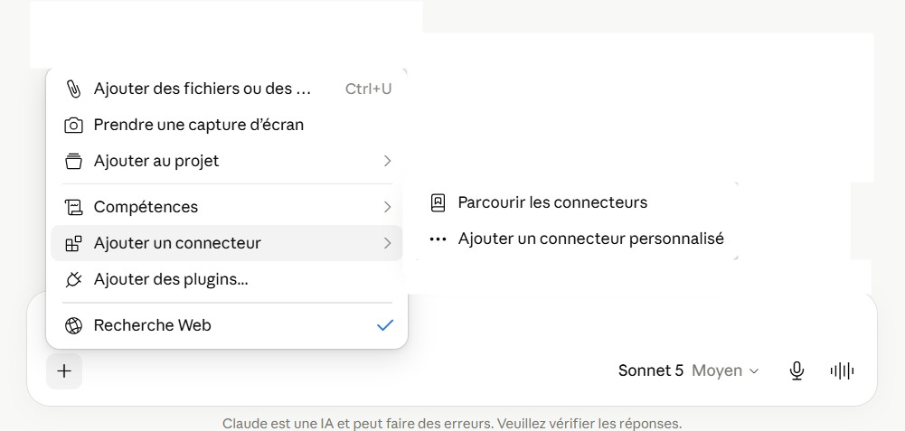
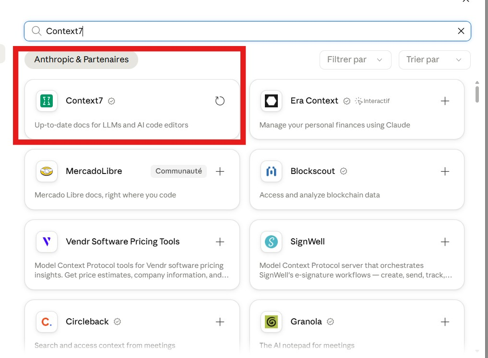
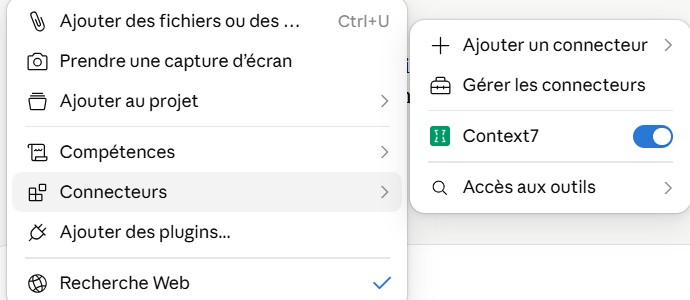

### Explications détaillés pour l'utilisation de Context7 :

#### Dans Claude :

Il suffit d'aller sur le plus dans la conversation, puis ouvrir "Ajouter un connecteur" puis "Parcourir les connecteurs" de cette façon.



Il faut ensuite tomber sur cette page, et chercher Context7 dans la barre de recherche, de cette façon.



Sur cette capture d'écran, on a déjà installé Context7 sur notre compte Claude. Si vous ne l'avez jamais fait 
vous aurez un symbole "+" au lieu du symbole recharger.

Il faut ensuite connecter le compte claude à Context7, en cliquant sur le bouton "Connecter".

Il faut ensuite aussi créer un compte sur Context7, avec le compte Github.

Ensuite, réouvrir une conversation et vous devriez avoir cettte fenêtre :



Ensuite, en fonction de ce que l'utilisateur a besoin de faire, il peut utiliser, comme j'ai dit auparavant les fonctions :

-  ```use library/hybridizer-io/hybridizer-io.github.io```
-  ```use library/hybridizer-io/hybridizer-basic-samples```

Ces deux librairies sont déjà disponibles sur le site Context7 que j'ai crée. Il n'y a donc rien de plus à fair epour pouvoir les utiliser.

Je ne sais pas comment faire en sorte d'avoir accès aux différentes versions (gratuites et payantes) avec Context7.

### Changer le nom des commit en utilisant Push Force :

J'ai réussi à changer le nom du dernier commit en utilisant la commande ```git commit --amend -m "Nouveau nom du commit"```.

Je cherche maintenant, si avec Context7, je peux avoir accès aux noms des commits de Modifications-Milan.

### Modifications des README :

Je continue à modifier ou rajouter les README des codes. Voici ceux que j'ai modifié :

Je m'assure de bien sauvegarder le README en markdown, la version que mon tuteur préfère.

Dossiers modifiés :
- BuiltIn
- HelloWorld
- InOut
- Intrinsics
- Malloc
- Mandelbrot
- Printf
- Recursion
- Reduction
- Sobel
- Sobel2D
- ConjugateGradient
- Mandelbulb
- MonteCarloHeatEquation
- NaiveMatrix

On va donc faire un pull request de tout ces changements. Il faut absolument écrire le titre en anglais, et rajouter un commentaire en précisant quels codes ont été modifiés.

### Essai d'installation par Aïmene :

Après le test par Aïmene, je vais devoir apporter quelques modifications au docs de l'installation.

J'ai pu noter plusieurs points où il y a eu des blocages dans l'installation. Je les notes donc à la suite :

- Préciser que, pour utiliser Hybridizer, il faut avoir installé VS2022, sinon CUDA Toolkit ne fonctionnera pas. Au début du site.
- Rajouter une phrase "cliquer" après le petit 2 de l'étape 1. 
- Répaerer le lien vers le site NVIDIA pour le toolkit 13.0.
- Préciser la version CUDA très tôt.
- Mettre en gras les informations importantes dans les exemples de command prompt.
- Montrer qu'il ne faut pas installer le driver à l'étape 2, mais seulement le toolkit.
- Reessayer l'installation par VSCode. 

#### Changements faits au setup :

Sur le document setup, j'ai donc fait tous les points notés ci-dessus. 

Je vais donc faire un pull request sur le repo git du site hybridizer io.

J'ai réussi, je me remets donc à faire les modifications des noms de commit pour les basic samples.

#### Modifications des noms des commits :

Pour l'instant, j'ai réussi à modifier les noms des commits en suivant cette logique : 

- Aller sur l'invite de commande 
- Trouver le bon fichier que je veux modifier
- écrire : ```git log --oneline```
- écrire : ```git rebase -i Head~3```
- Un nouvel onglet du notepad s'ouvre, et il faut que je remplace le "pick" devant le numéro et le nom du commit par "reword"
- Il faut ensuite sauvegarder et fermer le notepad.
- Un nouvel onglet du notepad s'ouvre, et il faut que je remplace le nom du commit par celui que je veux
- Il faut ensuite sauvegarder et fermer le notepad.
- écrire : ```git push --force-with-lease ```
- Le nom du commit devrait être changé !

Interessant à savoir : Le numéro après Head correspond au nombre de commits que je peux atteindre.

#### Découverte des MCP avec les différentes IA : 

J'en profite pour installer Claude sur mon ordinateur.

à faire : 
- Reessayer l'installation par Aimene, cette fois en utilisant Studio Code.
- Trouver les MCP par d'autres agents IA que Claude. Surtout Gemini, CodeX et ChatGPT. Relier le MCP au Context7.
- Continuer les README. Fait
- Continuer de changer les noms des commits. Fait

### Conseils d'Antoine
- Kimi est le meilleur, Mamooth.ai. 
- Mistral est bon en français.
- Anki est bon pour apprendre par coeur.

#### Dernier jour :

Maintenant que j'ai installé Claude sur mon ordinateur, je m'instruit sur les connecteurs et les MCP disponibles à l'installation.

J'essaye donc d'installer Windows MCP, mais il semble y avoir un problème.

J'essaye donc d'installer le Connecteur Control Chrome, qui permet de contrôler les onglets chrome.

Ensuite j'installe pdf-viewer, qui me permettra d'annoter les pdf.

Je constate néanmoins que le reste des connecteurs ne m'interessent pas beaucoup. 

J'installe ensuite ces 4 plug-ins :

- Productivity
- Engineering
- Data
- Pdf Viewer

Et j'installe ces 2 Compétences :

- mcp-builder
- web-artifacts-builder

Il faut maintenant que je comprenne comment marchent tous ces outils.

Je pose pleins de questions à claude, en utilisant la compétence mcp-builder.

Voici un résumé de ce que j'ai compris, en rapport avec Hybridizer :

Les bases sont les suivantes : 

- Protocole, le MCP est un serveur qui expose des "tools" exposé par mon serveur
- les "tools" sont des fonctions qui permettent de structurer les données et de l'envoyer à l'IA.

Je lance maintenant Claude sur la création d'un serveur MCP pour les repos basic-samples et hybridizer-io.github.io. 

Après plusieurs tentatives, je me rends compte que c'est beaucoup plus compliqué que prévu, je continue quand meme.

#### Deuxième Tentative de téléchargement par Aïmene :

On s'est rendu compte que l'on pourrait peur être essayer de faire l'installation, mais utiliser VSCode à la place de VS2022.

On reprends donc de l'étape 5; En partant du principe que vu qu'on utilise pas VS2022, il n'y a pas besoin d'installer le Toolchain C++.

Aïmene utilise de préférence antigravity, l'équivalent de Visual Studio Code, fait pas Google, et on utilise donc celui là. 

Après un premier echec dû au fait que l'installation était impossible depuis un dossier de System32, on réussit à installer Hybridizer depuis les lignes de commandes.

Pour l'étape 6 : Git était déjà installé, donc il n'y a rien eu à faire. 

Pour l'étape 7 : Comme pour moi, le code proposé ne fonctionnait pas si on le copie colle dans un projet, je décide donc de le supprimer de la page web car il induit en erreur.

On passe ensuite aux tests par le terminal, et le git clone se fait sans soucis. Lors du build des exemples, nous avons un problème avec le build.

Première piste : Repasser par l'étape 4, et installer le Toolchain C++.

Aïmene installe donc VSCommunity2022, et réussit à mettre les mêmes caractéristiques que sur mon PC, et on refait le test.

Encore une erreur, mais cette fois-ci, le build se lance mais donne une erreur.

Ensuite, il écrit : ```dotnet tool install -g Hybridizer```, et le code fonctionne. 

C'est réussi ! 