### Troisème Semaine : Validation des Exemples

En faisant tourner le dernier exemple de la semaine dernière, notre console nous donne : 

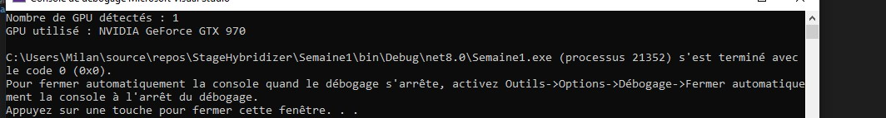

Pour pouvoir faire d'autres tests, il faut créer des kernels CUDA, donc je vais suivre les étapes suivantes : 

Depuis VS Code:

Ouvre un dossier de travail dans VS Code (par exemple un dossier tests-cuda que tu crées à côté de ton projet Hybridizer)

Clic droit dans l'explorateur de fichiers → Nouveau fichier → tape vectorAdd.cu
Colle le contenu du kernel dedans
Ctrl+S pour sauvegarder

le contenu en question : 
```csharp

ppextern "C" __global__ void VectorAdd(float* a, float* b, float* result, int n)
{
    int i = blockIdx.x * blockDim.x + threadIdx.x;
    if (i < n) result[i] = a[i] + b[i];
}

```

J'ai pleins de problèmes avec l'enregistrement du fichier VectorAdd.cu depuis VSCODE, je le fais donc depuis VS2022.

D'autres erreurs, quand j'essaye de le faire marcher avec cette ligne dans le terminal : 

```csharp
nvcc -ptx VectorAdd.cu -o VectorAdd.ptx
```

La console écris un texte infini et ne s'arrête jamais, je dois donc l'interrompre en fermant la page.

Je cherche une autre solution à ce problème.

Je vérifie que le nvcc marche bien, et que le PATH se trouve également au bon endroit.

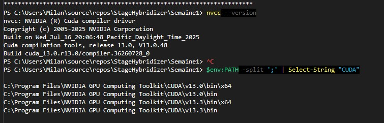

A priori, pas de problèmes. 

# Installation depuis un autre PC

À l'occcasion de ma prmière journée au bureaux de la défense, j'ai pu tenter l'installation depuis mon PC portable, pour voir
si le problème venait de mon PC fixe.

Je vais maintenant détailler l'installation de Hybridizer sur un autre PC, qui est beaucoup plus lent que celui-ci. L'installation a fonctionné sur l'autre, 
mais il y a beaucoup de choses à changer sur le tuto disponible dans la doc.

### Première étape : Ouvrir NVIDIA GEFORCE EXPERIENCE

- Sur l'appli que l'on peut ouvrir facilement depuis le menu démarrer, on va dans l'onglet Drivers.
- On tombe sur cet onglet : 

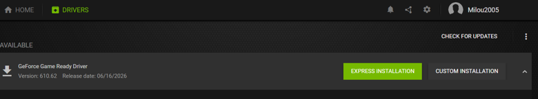

- On clique ensuite sur Installation Express.
- On ouvre ensuite l'invite de commandes, encore depuis la barre de recherche démarrer :
- On tape : ``` nvidia-smi ```
- On retrouve normalement : 

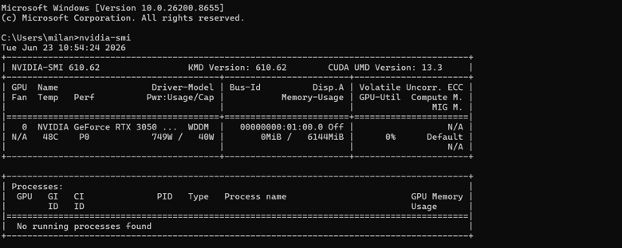

### Deuxième étape : Installer CUDA Toolkit
- Contrairement à ce qui est indiqué dans le tuto, il faut installer CUDA Toolkit 13.0, et non pas 13.3.
- Voici le lien pour le téléchargement : https://developer.nvidia.com/cuda-13-0-0-download-archive
- Ensuite, il faut cliquer sur les bons choix, afin d'avoir : 

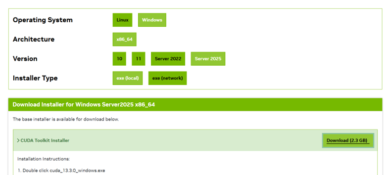

- On clique ensuite sur le bouton "Download" pour télécharger le fichier d'installation.
- Pendant l'installation, les choix de base conviennent parfaitement.
- On ouvre encore l'invite de commandes
- On tape : ``` nvcc --version ```
- Si tout se passe bien, on retrouve : 


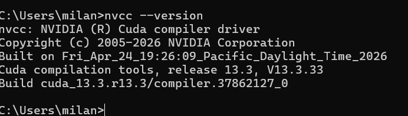
Par exemple, pour une installation avec Visual Studio 2022, on retrouve : 

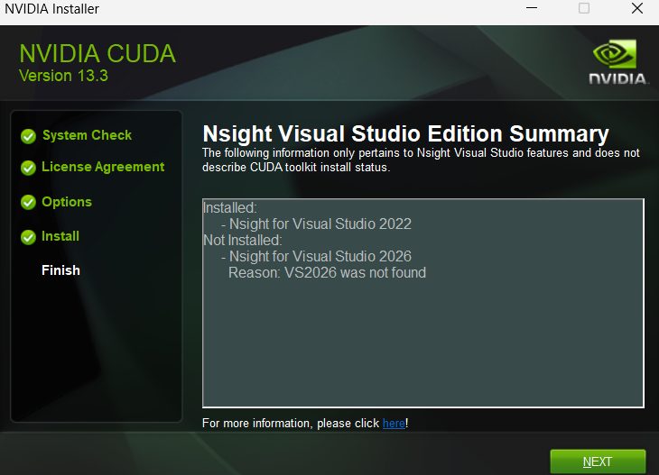

### Troisième étape : Installer .NET 8 SDK

- aller sur ce lien : https://dotnet.microsoft.com/fr-fr/download/dotnet/8.0
- Clique ici :

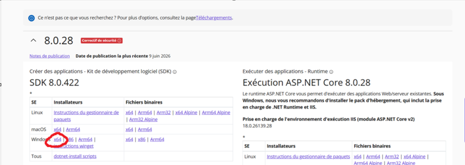

- Pour moi, L'installation s'est faite sans problème.

### Quatrième étape : Installer un C++ Toolchain : 

- On ouvre Visual Studio Installer, une appli qui est installée avec Visual Studio 2022.
- Quand on l'ouvre, il faut cliquer sur modifier, de cette façon : 

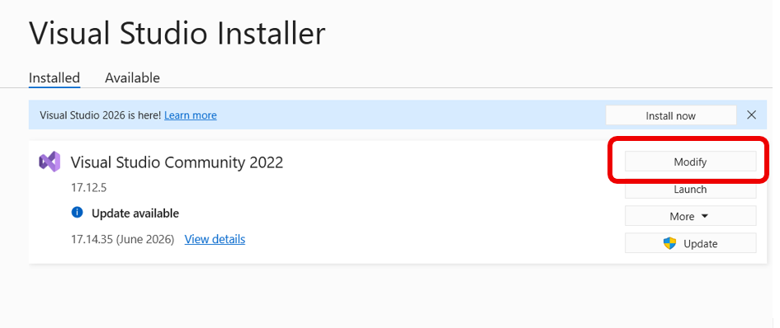

- Il faut ensuite séléctionner les deux options entourées : 

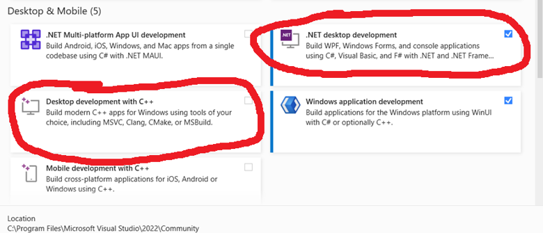

Une fois installés, vérifiez en repassant par l'option modifier, que les deux options sont bien cochées.

### Cinquième étape : Installer Hybridizer

- Ouvrez Visual Studio 2022, faites un clic droit sur votre solution et trouvez l'option Open In Terminal.

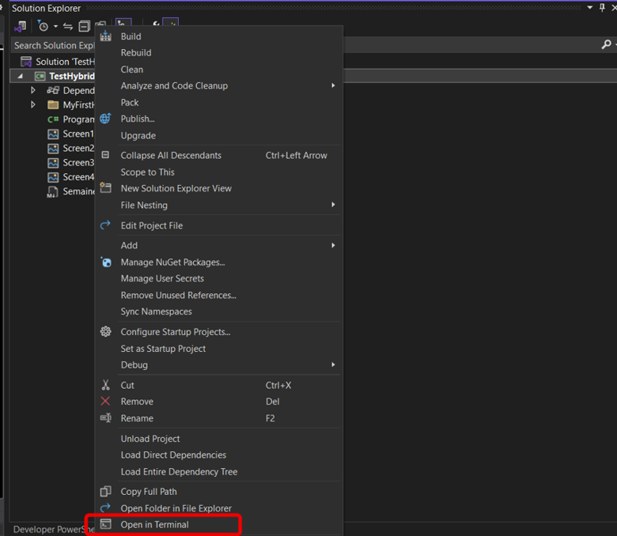

- Dans le terminal, il faut maintenant taper la commande suivante : 
- 
``` dotnet new console -n MyFirstHybridizer --framework net8.0 ```

Puis : ``` cd MyFirstHybridizer ```

Puis :  ``` dotnet add package Hybridizer.Runtime.CUDAImports ```

Cela va créer un nouveau dossier MyFirstHybridizer, qui contient un projet .NET 8.0, et qui a pour dépendance Hybridizer.Runtime.CUDAImports.
On conseille vivement de ne garder que ce projet dans l'explorateur de solutions, ce qui réduit le nomnre d'erreurs possibles.

Votre explorateur de solutions devrait ressembler à ça :

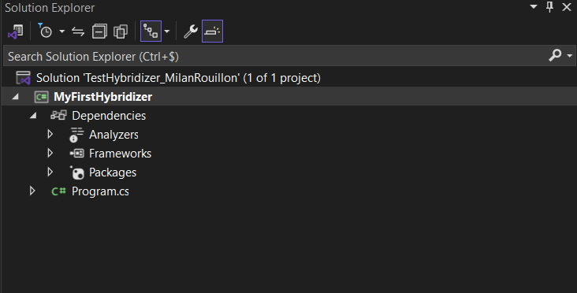

N'oubliez pas de fermer et de rouvrir Visual Studio 2022 !

### Sixième étape : Installer Git

Une fois installé, vérifiez dans le terminal Visual Studio  :``` git --version ```

Vous devrez retrouver votre version git, si l'installation s'est faite correctement. 

### Septième étape : Charger le git hybridizer basic samples.

- Retournez maintenant dans le terminal Visual Studio, et tapez :

``` git clone https://github.com/hybridizer-io/hybridizer-basic-samples.git ```

- N'oubliez pas de bien choisir le dossier dans lequel vous voulez cloner le git, car il va créer un dossier hybridizer-basic-samples dedans.

- Ensuite, il faut accéder au dossier hybridizer-basic-samples avec la commande cd dans le terminal Visual Studio.

- Pour effectuer ses premiers tests, il faut taper cette commande : 

``` cd hybridizer-basic-samples/src/1.Simple/HelloWorld ```

- Ensuite, il faut taper : 
``` dotnet build ```

- Puis : ``` dotnet run ```

- Vous devrez donc avoir ces informations dans le terminal : 

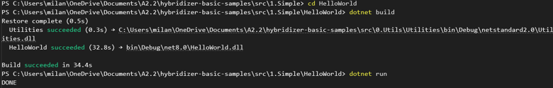

- Ensuite, faites : ``` cd .. ```
- Puis : ``` cd .. ``` , ``` dotnet build ```, ``` dotnet run ``` dans cet ordre.

Vous aurez donc cet interface dans le développeur Powershell : 

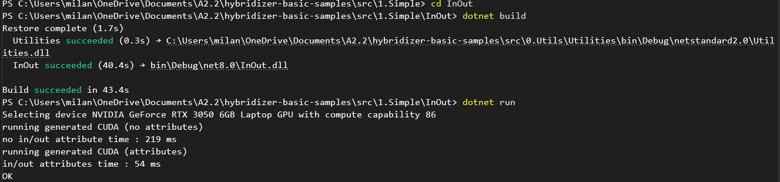

Fin des étapes de mon installation sur mon PC Portable.

## Points Importants à retenir : 

Lorsque je modifierais le tuto présent sur la doc, je vais devoir modifier les points suivants : 

- Il faut absolument préciser que seul CUDA Toolkit 13.0 est supporté, et que sans cette condition le programme ne pourra pas tourner.
- Il faut également absolument préciser qu'il faut également un GPU qui puisse tourner avec CUDA 13.0, 
ce qui n'était pas mon cas.

## Prochaines étapes :

Je vais maintenant cloner le repo github de Hybridizer, pour commencer à me familiariser avec le code des sites, 
tout en essayant les exemples donnés sur mon PC portable, pour voir si ces derniers fonctionnent .